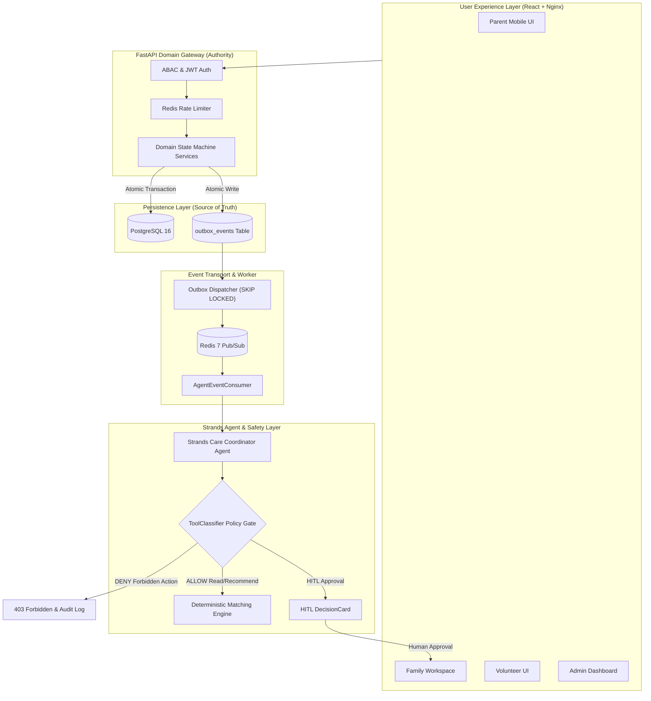
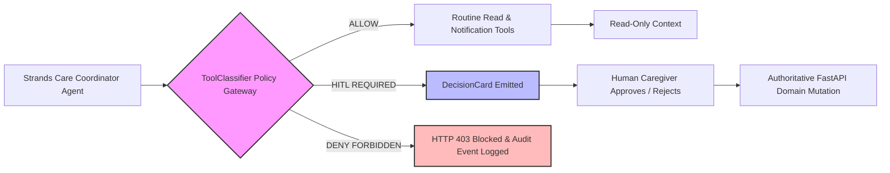

# 🩵 CareSync — AI-Coordinated Family Care Network

> **"CareSync's agent coordinates the workflow and requests a deterministic matching recommendation. A human approves consequential assignments."**

CareSync is a production-oriented, event-driven care coordination platform designed to support aging parents, family caregivers, and verified volunteers. Powered by the **AWS Strands Agents SDK (`strands-agents`)**, CareSync transforms fragmented family communication into an intelligent, deterministic, human-in-the-loop care network.

---

## 🌟 Why CareSync is an Event-Driven Agentic System, Not a Chatbot

| Dimension | Conventional Chatbot | CareSync Agentic System |
| :--- | :--- | :--- |
| **Interaction Model** | Reactive text box conversation | Quiet background observer watching event outbox facts |
| **Authority** | Often hallucinates or executes actions directly | Zero executive authority; policy-gated by FastAPI domain layer |
| **Database Access** | Direct write or unsafe API calls | Read-only application tools; zero direct SQL mutations |
| **Consequential Actions**| Attempts to act autonomously | Emits Human-in-the-Loop **DecisionCards** for caregiver approval |
| **State Persistence** | Unstructured chat session memory | Transactional Outbox pattern in PostgreSQL |

---

## 📐 System Architecture & Safety Boundary Diagrams

### 1. End-to-End System Architecture



---

### 2. Safety Boundary Diagram



---

## 🔒 Hard Security & Agent Safety Invariants

1. **The FastAPI Domain Layer is Authoritative**: The AI model has **zero executive authority** to mutate domain state directly.
2. **PostgreSQL is the Source of Truth**: All domain mutations and outbox events commit atomically in PostgreSQL. Redis is strictly a transient distribution transport.
3. **Deterministic Candidate Matching**: Matching recommendations are calculated by a deterministic scoring algorithm (location, availability, skills, trust tier) — not by LLM generation.
4. **Policy Gateway (`ToolClassifier`)**: Server-side tool execution gate blocks unauthorized tool calls (`assign_volunteer`, `direct_sql_mutation`, `change_medication_dosage`) with **HTTP 403 Forbidden** and logs immutable `AGENT_FORBIDDEN_ACTION_BLOCKED` audit events.
5. **Trust & Safety Protection**: Complaints against caregivers trigger **protective temporary suspension** with neutral, non-judgmental wording (*"Temporarily unavailable pending safety review"*). Trust logs are **INSERT-ONLY** (no UPDATE/DELETE paths).

---

## 🚀 Quickstart & Setup Guide

### Option 1: Single-Command Docker Compose (Recommended)

To run the entire 6-container production-oriented stack (Frontend, Backend, PostgreSQL, Redis, Worker, Agent):

```bash
docker compose up --build
```

Access services at:
- **Frontend App**: `http://localhost:3000`
- **FastAPI API**: `http://localhost:8000/docs`
- **Liveness Probe**: `http://localhost:8000/health/liveness`
- **Readiness Probe**: `http://localhost:8000/health/readiness`

---

### Option 2: Local Python & Node Setup

#### 1. Backend Setup (FastAPI & PostgreSQL)

```bash
cd backend
python -m venv venv
# On Windows:
.\venv\Scripts\activate
# On Linux/macOS:
source venv/bin/activate

pip install -r requirements.txt
alembic upgrade head
uvicorn app.main:app --reload --port 8000
```

#### 2. Frontend Setup (React & Vite)

```bash
cd frontend
npm install
npm run dev
```

---

## 🧪 Testing & Verification

### Run Backend Pytest Suite (162 Tests)

```bash
cd backend
python -m pytest -vv
```

### Run Frontend Quality Checks

```bash
cd frontend
npm run lint    # Verifies 0 oxlint warnings/errors
npm run build   # Compiles Vite production bundle
```

---

## 🔁 Resettable Demo Dataset Endpoint

CareSync includes a deterministic demo reset endpoint for live presentations (controlled by `DEMO_RESET_ENABLED` environment setting):

```http
POST /api/v1/demo/reset
```

Calling this endpoint clears transient data and seeds baseline records:
- **Parent**: Susan Woodson (78)
- **Primary Caregiver**: David Woodson (Son)
- **Verified Volunteer**: David Miller (Background checked, 100% reliability)
- **Care Request**: Grocery pickup request (`PENDING_ASSIGNMENT`)
- **DecisionCard**: `"Approve Grocery Helper Recommendation"`

---

## 📜 License

CareSync is released under the **MIT License**.
