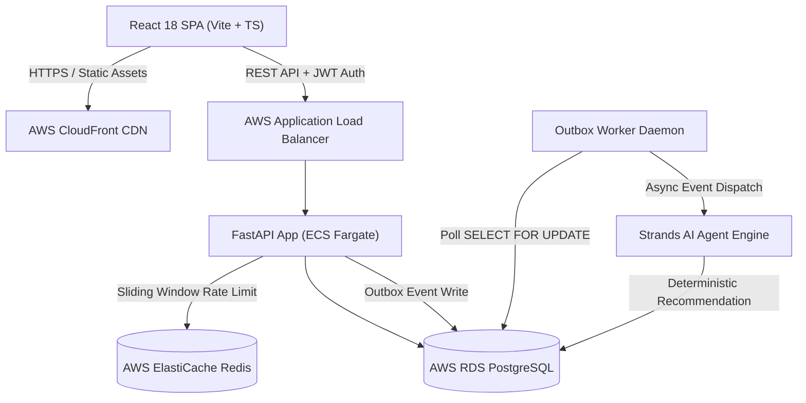

# CareSync — System Architecture & Technical Specifications

**Documentation Version**: 1.0.0 (Phase 13F Final)  
**Infrastructure**: AWS ECS Fargate + RDS PostgreSQL + Redis ElastiCache + CloudFront + Secrets Manager

---

## 1. System Architecture Diagram

---

## 2. Layer Specifications

### Frontend (User Interface)
- **Framework**: React 18 with TypeScript & Vite.
- **Styling**: Vanilla CSS with curated CareSync design system tokens (Warm `#FAF7F1` canvas, `#16866B` primary green, `#FAF7F1` card tokens).
- **Icons**: Lucide React.
- **Routing**: React Router DOM with `AppRouter.tsx` identity-guarded route protection.

### Backend (API Services)
- **Framework**: Python 3.12 with FastAPI & Async Pydantic.
- **ORM & DB**: SQLAlchemy 2.0 Async (`asyncpg` / `aiosqlite`) with PostgreSQL.
- **Authentication**: Cryptographic OTP delivery + HS256 JWT Bearer token authentication.
- **Observability**: Structured JSON logger with correlation IDs and execution time tracing (`caresync.observability`).

### AI Agent & Matching Engine
- **Agent Architecture**: Strands Agent framework with custom tools.
- **Matching Engine**: Deterministic multi-stage filter & scorer:
  1. Hard constraint filter (availability, skills, location radius).
  2. Scoring weights (distance weight 0.35, history weight 0.35, capability weight 0.30).
  3. Recommendation output formatted as a Human-in-the-Loop `DecisionCard`.

### Event Outbox & Reliable Dispatch
- **Pattern**: Transactional Outbox Pattern (`OutboxEvent` & `ProcessedEvent`).
- **Claim Strategy**: `SELECT FOR UPDATE SKIP LOCKED` database row locks.
- **Fault Tolerance**: Automatic retries, orphan event recovery, graceful Redis fallback.

---

## 3. Production Security Architecture

- **Secrets Management**: Zero hardcoded plaintext credentials in source code. Credentials injected via AWS Secrets Manager / Environment variables.
- **RBAC / ABAC Security**: Fine-grained authorization enforced per-endpoint via `CarePermission` checks and user role validations.
- **Rate Limiting**: Sliding window rate limiter with Redis backend and in-memory fallback.
